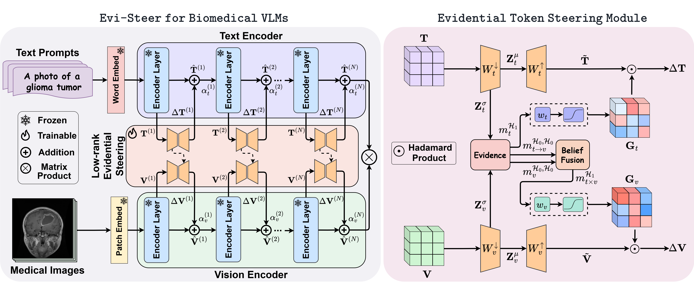

<div align="center">

# Evi-Steer: Learning to Steer Biomedical Vision-Language Models through Efficient and Generalizable Evidential Tuning
**[Health-X Lab](http://www.healthx-lab.ca/)** | **[IMPACT Lab](https://users.encs.concordia.ca/~impact/)** 

[Taha Koleilat](https://tahakoleilat.github.io/), [Hassan Rivaz](https://users.encs.concordia.ca/~hrivaz/), [Yiming Xiao](https://yimingxiao.weebly.com/curriculum-vitae.html)

<a href="https://arxiv.org/abs/2602.20423" target="_blank"></a>
<a href="https://tahakoleilat.github.io/Evi-Steer" target="_blank"></a>
<a href="https://huggingface.co/datasets/TahaKoleilat/BiomedCoOp" target="_blank"></a>
<a href="https://huggingface.co/TahaKoleilat/Evi-Steer" target="_blank"></a>
<a href="#citation"></a>

</div>

## Overview


> **<p align="justify"> Abstract:** *Parameter-efficient adaptation of vision-language foundation models is crucial for precise multimodal understanding of biomedical images, yet existing methods remain deterministic and often struggle under domain shift or ambiguous image-text alignment. This limitation is particularly critical in the clinic, where models should remain robust in low-data regimes and domain shifts. We present **Evi-Steer**, an **evidential cross-modal low-dimensional steering** framework for BiomedCLIP that enables uncertainty-aware parameter-efficient fine-tuning while updating only **0.11% of total model parameters**. Our approach performs lightweight low-dimensional token updates in both vision and text encoders while simultaneously estimating epistemic uncertainty. These uncertainty estimates update gate residuals, allowing the model to adapt conservatively when evidence is weak. Furthermore, we introduce cross-modal confidence fusion based on **Dempster-Shafer theory**, enabling visual adaptation to be conditioned on textual confidence and suppressing conflicting or uncertain cross-modal updates. We conduct a comprehensive evaluation on 15 biomedical imaging datasets spanning 8 organs and 8 imaging modalities under few-shot learning and domain generalization settings. **Evi-Steer** consistently outperforms state-of-the-art methods under few-shot learning and domain shift settings, demonstrating a practical and robust pathway for deploying vision-language models in real-world clinical settings.* </p>

## Method

<p float="left">
  
</p>

1) **Uncertainty-Aware Parameter-Efficient Adaptation**: We introduce *Evi-Steer*, the first evidential low-dimensional representation steering framework for biomedical vision–language models, enabling confidence-aware fine-tuning while updating only **0.11%** of the total model parameters.  
2) **Evidential Low-Dimensional Representation Steering**: We propose a novel adaptation strategy that performs lightweight low-dimensional updates directly in the activation space while simultaneously estimating **Latent Dimension (LD) Epistemic Uncertainty**, allowing updates to be **confidence-weighted and conservatively gated**.  
3) **Cross-Modal Reliability Fusion**: We develop a Dempster–Shafer–based fusion mechanism that conditions **visual adaptation on textual confidence**, suppressing conflicting or ambiguous updates and improving robustness under domain shift.  
4) **Robust Few-Shot and Domain Generalization**: Through comprehensive evaluation on **15 biomedical imaging datasets across 8 organs and 8 modalities**, we demonstrate consistent gains in **few-shot learning and out-of-distribution transfer**, establishing uncertainty-aware adaptation as a practical pathway for real-world clinical deployment.


## Results
Results reported below show accuracy for few-shot scenarios as well as domain generalization across 15 biomedical domain recognition datasets averaged over 3 seeds.

### Few-shot Evaluation

| **Method** | **K=4** | **K=8** | **K=16** |
|---|:---:|:---:|:---:|
| Zero-shot BiomedCLIP | – | 43.81 | – |
| CoOp | 65.52 | 72.36 | 76.26 |
| CoCoOp | 60.63 | 67.75 | 72.25 |
| KgCoOp | 65.19 | 70.74 | 72.48 |
| ProGrad | 66.33 | 71.76 | 73.98 |
| BiomedCoOp | _67.50_ | 72.43 | 77.15 |
| LP++ | 65.51 | 70.85 | 75.42 |
| CLIP-Adapter | 47.11 | 48.51 | 50.60 |
| Tip-Adapter-F | 66.22 | 72.73 | _77.60_ |
| GDA | 67.34 | _74.92_ | 77.23 |
| CLIP-LoRA | 65.93 | 72.47 | 74.75 |
| **Evi-Steer (Ours)** | **71.43** | **77.33** | **81.18** |

### Domain Generalization

| **Method** | **ID** | **OOD** | **HM** |
|---|:---:|:---:|:---:|
| Zero-shot BiomedCLIP | 58.27 | 60.65 | 59.44 |
| CoOp | 75.93 | 73.46 | 74.67 |
| CoCoOp | 74.33 | 71.32 | 72.79 |
| ProGrad | _77.05_ | 73.36 | 75.16 |
| KgCoOp | 75.85 | _75.03_ | _75.44_ |
| GDA | 74.36 | 70.72 | 72.49 |
| CLIP-LoRA | 75.81 | 71.69 | 73.69 |
| BiomedCoOp | _76.82_ | 72.30 | 74.49 |
| **Evi-Steer (Ours)** | **79.78** | **77.95** | **78.85** |


---


## Installation 
For installation and other package requirements, please follow the instructions detailed in [INSTALL.md](assets/INSTALL.md). 

## Data preparation
Please follow the instructions at [DATASETS.md](assets/DATASETS.md) to prepare all datasets.

## Training and Evaluation
Please refer to the [RUN.md](assets/RUN.md) for detailed instructions on training, evaluating and reproducing the results using our pre-trained models.

<hr />

## Citation
If you use our work, please consider citing:
```bibtex
@article{koleilat2026evisteer,
  title={Evi-Steer: Learning to Steer Biomedical Vision-Language Models through Efficient and Generalizable Evidential Tuning},
  author={Koleilat, Taha and Rivaz, Hassan and Xiao, Yiming},
  journal={arXiv preprint arXiv:2509.03740},
  year={2026}
}

@inproceedings{koleilat2025biomedcoop,
  title={Biomedcoop: Learning to prompt for biomedical vision-language models},
  author={Koleilat, Taha and Asgariandehkordi, Hojat and Rivaz, Hassan and Xiao, Yiming},
  booktitle={Proceedings of the Computer Vision and Pattern Recognition Conference},
  pages={14766--14776},
  year={2025}
}

@article{koleilat2025singular,
  title={Singular Value Few-shot Adaptation of Vision-Language Models},
  author={Koleilat, Taha and Rivaz, Hassan and Xiao, Yiming},
  journal={arXiv preprint arXiv:2509.03740},
  year={2025}
}
```

## Acknowledgements

Our code builds upon the [BiomedCoOp](https://github.com/HealthX-Lab/BiomedCoOp) and [CLIP-SVD](https://github.com/HealthX-Lab/CLIP-SVD) repositories.
